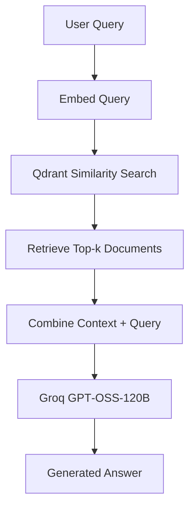

# Retrieval-Augmented Generation (RAG) with Qdrant and Groq

## Overview
This repository provides a **Google Colab notebook** that demonstrates a high‑performance Retrieval‑Augmented Generation (RAG) pipeline using:
- **Qdrant** – a vector database for fast similarity search.
- **Sentence‑Transformers** – for generating 384‑dimensional embeddings.
- **Groq** – cloud inference platform hosting the open‑weight **GPT‑OSS‑120B** model.

The notebook is fully self‑contained and can be run in a Colab environment without any local setup.

---

## Table of Contents
- [Features](#features)
- [Prerequisites](#prerequisites)
- [Setup Instructions](#setup-instructions)
- [Running the Notebook](#running-the-notebook)
- [How the Pipeline Works](#how-the-pipeline-works)
- [License](#license)

---

## Features
- **Fast Embeddings** – Uses `all-MiniLM-L6-v2` for lightweight, real‑time document indexing.
- **High‑Speed Inference** – Groq’s LPU delivers near‑instant responses from the 120B‑parameter model.
- **Secure Credential Handling** – Leverages Colab Secrets to keep API keys private.
- **Scalable Vector Search** – Direct integration with Qdrant for efficient semantic retrieval.

---

## Prerequisites
| Item | Description |
|------|-------------|
| Qdrant Endpoint & API Key | Obtain from **Qdrant Cloud** (or run a local Qdrant instance). |
| Groq API Key | Generate in the **Groq Console**. |
| Google Colab account | Required to run the notebook. |

The notebook will automatically install the following Python packages:
- `qdrant-client`
- `sentence-transformers`
- `groq`

---

## Setup Instructions
1. **Open the notebook in Colab** – Click the *Open in Colab* badge or upload `RAG_with_Qdrant.ipynb` to your Google Drive and open it.
2. **Add Secrets** – In the left sidebar, click the **Key (Secrets)** icon and add:
   - `QDRANT_ENDPOINT`
   - `QDRANT_API_KEY`
   - `GROQ_API_KEY`
3. **Run the notebook** – Execute cells sequentially. The first cells install dependencies, configure clients, and ingest sample documents.

---

## Running the Notebook
The notebook follows these steps:
1. **Embedding Generation** – Documents are transformed into vectors using the MiniLM model.
2. **Upsert to Qdrant** – Vectors are stored in a Qdrant collection for fast lookup.
3. **Query Processing** – User queries are embedded and the most similar documents are retrieved.
4. **Response Generation** – The retrieved context and the query are sent to Groq’s `gpt-oss-120b` model, which returns a grounded answer.

Feel free to replace the sample documents with your own data and adjust the collection name as needed.

---

## How the Pipeline Works

---

## License
This project is licensed under the **MIT License**. See the `LICENSE` file for details.

---

*For any questions or contributions, please open an issue or submit a pull request.*
